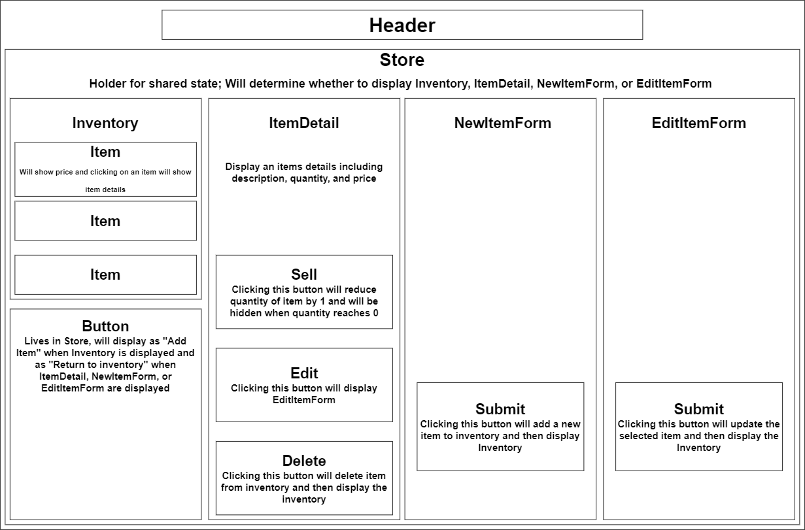

# _**What A Teas**_

#### _Tracker for teas sold by the ounce_

### By _**Joshua Khan**_

## Description

React application for tracking inventory of tea

## Component Diagram

## Setup/Installation Requirements

1. Visit the repository at https://github.com/Khanjo/inventory-tracker.
2. Clone or download the project.
3. Navigate to the directory in your teminal: **Your Filepath/**`inventory-tracker`.
4. Enter the commands `npm install` and `npm run start` to launch the application.

## Known Bugs

No **known** bugs

## Technologies Used

* HTML
* React
* JavaScript
* JSX
* VSCode
* node.js

### License

[MIT License.](https://opensource.org/license/mit/)

Copyright (c) 2023 _**Joshua Khan**_